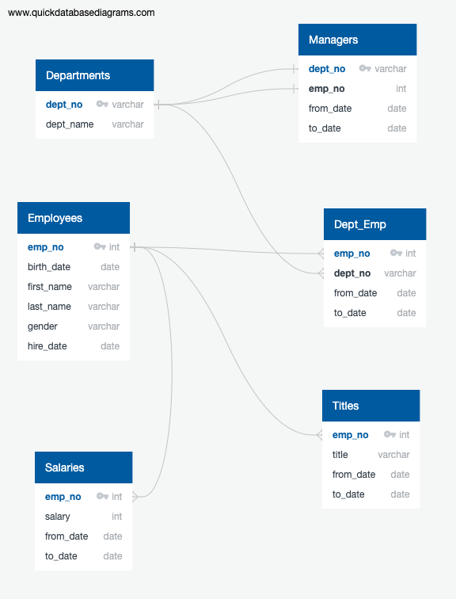
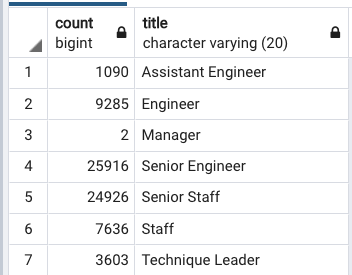
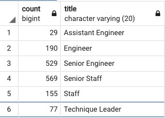

# Pewlett-Hackard-Analysis
Pewlett-Hackard is a large multi-national corparation that's been around for generations and is the industry leader in quality Chihuahua apparel. In order to stay competitive in the marketplace, Pewlett-Hackard needs to recruit new young talent to replace older employess that will eventually be transitioning to retirement. Pewlett-Hackards way of collecting employee information might have worked when it was initially only a 20 person team in the 1960's but now with hundreds of employess its difficult to scale. For example, our HR department keeps track of various employee data in 6 different csv files versus the more modern approach with a centralized database. The problem with this legacy approach is we can't see the relationships between these various datasets nor can we do any forecasting or data modeling. With a centralized database we can use sql to analyze employee data and provide reports to executives. 

The first step towards modernizing PHs employee records system was to first gather the existing employee csv data from HR and create an entity relationship diagram so we can figure out how to create the tables in our database. 

 

Once we mapped out our data types and could determine the relationships between the different csv files we created database tables for each csv file and link our various tables together via primary and foreign keys. Primary keys are a column in a table that hold unique values and foreign keys are columns in a table that reference another tables primary key. Primary keys and foreign keys are essential in joining tables when performing analysis. To import our csv data into our new database tables we had to make sure that the table data types we selected matched up with the data we were importing. For example, when you create a column to hold text you declare it as a varchar followed by a number that represents the maximum amount of characters that column will hold. If the text in your csv column is longer that what you set in your table the import will fail and you have to go back and recreate your table (what database admins call drop a table) and start over again. After a few hiccups we were able to successfully import all the csv data. 

Looking at our retirement data we can draw several conclusions. First off, if we use employees born between 1952 and 1955 as our baseline retirement age PH will have a total of 72,458 employees retiring this year. Breaking it down further here is a table that lists the retirements by department:  

<strong>* see query on line 35 of enclosed queries.sql file</strong>

As you can see we have a lot of work to do to fill all these positions that will open up next year. For a csv of retiring employees please see <strong>Pewlett-Hackard-Analysis/Analysis Projects Folder/Pewlett-Hackard-Analysis Folder/Data/updated_retiring_employees.csv</strong>

To guide PHs older employees on the cusp of retirement (Employees born in 1965), PH can employ a mentorship program. If we first take a look at the total number of eligible employees it adds up to 1,549 employees or broken down by department:

<strong>* see query on line 41 of enclosed queries.sql file</strong>  
For additional information on the employee mentorship program please see <strong>Pewlett-Hackard-Analysis/Analysis Projects Folder/Pewlett-Hackard-Analysis Folder/Data/employee_mentorship_program.csv</strong>